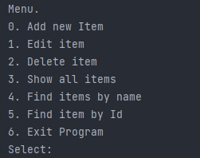
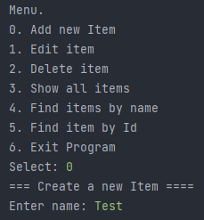
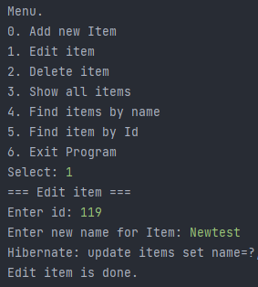
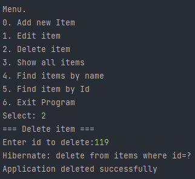
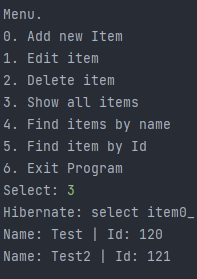
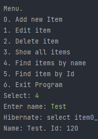
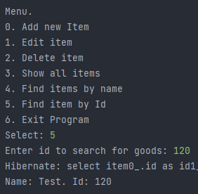
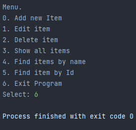

# Tracker

<h2>О проекте</h2>

Предназначен для закрепления знаний, полученных при изучении блока посвященного ООП.

Этот проект - консольное приложение. После запуска пользователю отображается меню с возможностями программы. Программа просит ввести в консоль пункт меню для дальнейшего действия. Например, пользователь ввел цифру 0. Система просит пользователя ввести имя заявки. После этого действия система сохраняет в памяти заявку и снова отображает пункты меню. Если пользователь выбрал пункт 6 - это будет выход из программы, т.е. программа закрывается.

  
  
  
  
  
  
  
  

<h2>Структура проекта</h2>
<ul>
  <li>Данные будут храниться в памяти. Хранилище будет описывать класс <a href="https://github.com/ValeraDanilov/job4j_tracker/blob/main/src/main/java/ru/job4j/tracker/store/MemTracker.java">ru.job4j.tracker.store.MemTracker</a></li>
  <li>Так же описано хранилище основанное на базе данных <a href="https://github.com/ValeraDanilov/job4j_tracker/blob/main/src/main/java/ru/job4j/tracker/jdbc/SqlTracker.java">ru.job4j.tracker.jdbc.SqlTracker</a></li>
  <li>Hibernate <a href="https://github.com/ValeraDanilov/job4j_tracker/blob/main/src/main/java/ru/job4j/tracker/hbn/HbmTracker.java">ru.job4j.tracker.hbn.HbmTracker</a> </li>
  <li>Объект этого класса будет описывать модель данных <a href="https://github.com/ValeraDanilov/job4j_tracker/blob/main/src/main/java/ru/job4j/tracker/Item.java">ru.job4j.tracker.Item</a></li>
  <li>Объект для управления меню <a href="https://github.com/ValeraDanilov/job4j_tracker/blob/main/src/main/java/ru/job4j/tracker/StartUI.java">ru.job4j.tracker.StartUI</a></li>
</ul>